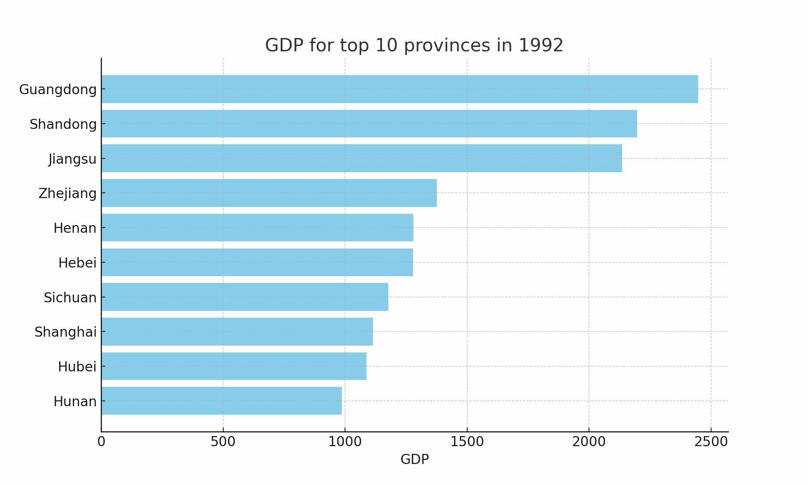
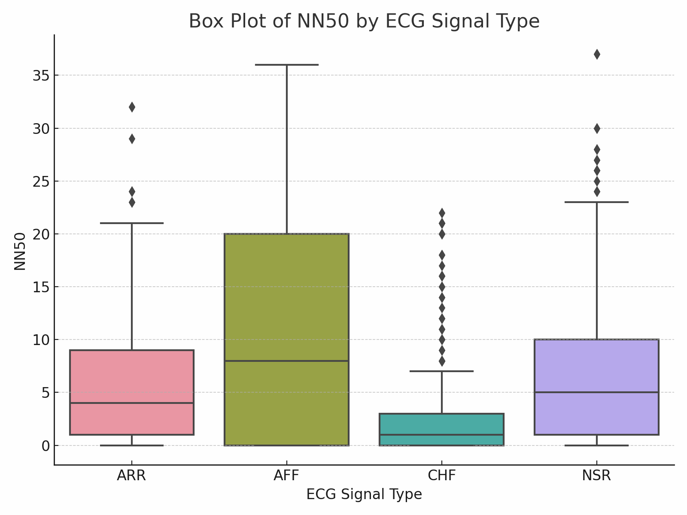

# ChatGPT Code Interpreter Examples

**Disclaimer:** This code repository is not maintained by OpenAI. It primarily documents use cases collected by myself or from the internet.

[中文版本](./readme_zh.md)

ChatGPT Code Interpreter is a powerful feature that combines the natural language processing capabilities of OpenAI's GPT-3 model with the ability to execute Python code. This tool allows users to input their queries in a conversational manner, and the model will interpret and execute the code accordingly. This provides a user-friendly interface for anyone who wishes to use Python without needing to know the exact syntax or operations.

## Usage and Examples

To interact with the ChatGPT Code Interpreter, simply start a session and input your query in a conversational manner. 

Here are a few examples of how you can use the ChatGPT Code Interpreter:

- **Example: Mathematical Calculations** You can ask the model to perform simple mathematical calculations like addition, subtraction, multiplication, division, and more. For example, "Calculate the sum of 5 and 3." The model will understand your request, generate the appropriate Python code, and execute it.

- **Example: Data Visualization** The model can help you generate plots using matplotlib or other visualization libraries. For instance, you can say, "Generate a scatter plot using this data." The model will generate and execute the appropriate code.

- **Example: Data Analysis** You can perform complex data manipulations using libraries like pandas. For example, you can ask, "What is the mean of this list of numbers?" and the model will calculate it for you.

- **Example: Learning Python** If you're learning Python, you can ask the model to provide explanations or generate code snippets for specific concepts. For example, "Show me how to write a for loop in Python."
## Real-World Examples

Here are some real-world examples of using the ChatGPT Code Interpreter:

- **Visualization of GDP Data for Provinces in China** [Data Source](https://www.kaggle.com/datasets/concyclics/chinas-gdp-in-province) [Chat Log](https://chat.openai.com/share/08c5aeb4-cfa1-4cba-9c87-ee0271658fd7)

- **Analysis of ECG Data for Cardiac Ailments** [Data Source](https://www.kaggle.com/datasets/akki2703/ecg-of-cardiac-ailments-dataset)

Prompt: Please help me analyze this data and perform as many effective visualizations as possible. You need to not only display all the visualization results, but also save all the visualization results as images, compress them, and send them to me.

## Safety Measures

ChatGPT Code Interpreter operates in a secure environment with no internet access. This ensures that no unauthorized web requests or API calls can be made during a session. The execution environment is also stateful, which means variables and functions are remembered across different code executions, allowing for a seamless coding experience.

Please note that the knowledge of the model is up to date only until September 2021, so it may not be aware of developments or changes in Python or its associated libraries after this date.

## Conclusion

ChatGPT Code Interpreter is a powerful tool that combines the advanced language understanding of GPT-3 with Python's versatile coding capabilities. Whether you're a coding novice or an experienced data analyst, it provides a user-friendly and interactive way to engage with Python. Try it out today!
